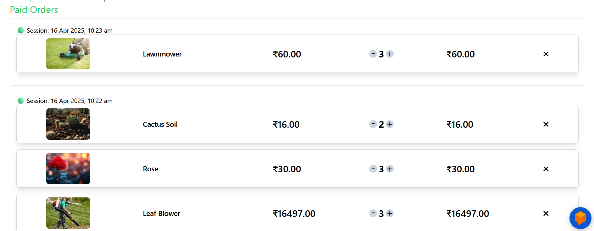
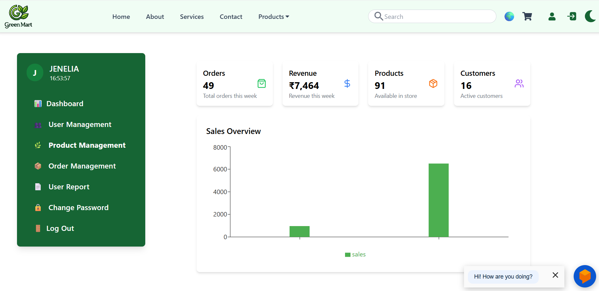
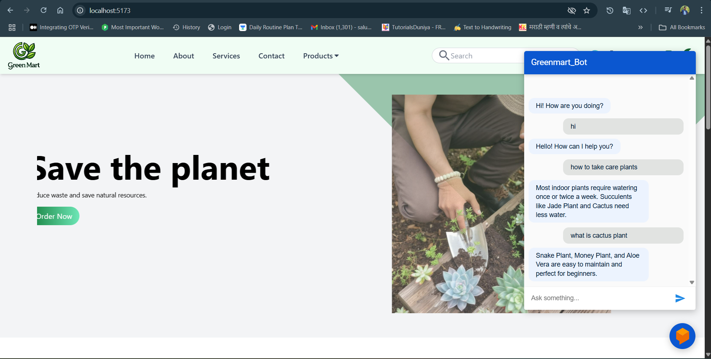

# 🛒 GreenMart Shopping App

GreenMart is a full-featured e-commerce platform for gardening and plant lovers. It includes a product catalog, cart, billing, admin panel, delivery system, chatbot assistance, and Google translation support for regional users.

---

## 📌 Features

- 🌿 Unique & rare seeds and gardening products
- 🧺 Cart & instant "Buy Now" checkout
- 💳 Online payment system with refund handling
- 🔁 Product return/cancel with payment updates
- 🧾 Dynamic bill generation from grouped cart items
- 🚚 Delivery system with OTP verification & auto-assignment
- 🤖 Chatbot assistant for plant care & product support
- 🌐 Google Translation for regional language support
- 👨‍🌾 Gardener appointment based on filters (state, age, language, etc.)
- 🛠️ Admin panel with CRUD, image upload, and category management
--  
## 🧠 Chatbot Feature
- Get instant care tips or usage guidance
- Integrated using Dialogflow & Firebase
---

## 🌍 Google Translation Support

- Google Translate API
- Users can switch between languages seamlessly
- Especially helpful for Indian regional customers

---

## 🛠️ Tech Stack

- **Frontend:** React, Tailwind CSS, Vite
- **Backend:** Node.js, Express
- **Database:** MySQL
- **Chatbot:** Dialogflow, Firebase
- **Other:** Multer, Google Maps API, i18n

---

## 📸 Screenshots

### 🏠 Homepage  

### 🛒 Cart Page  

### 📦 Admin Panel  

### 🤖 Chatbot  

